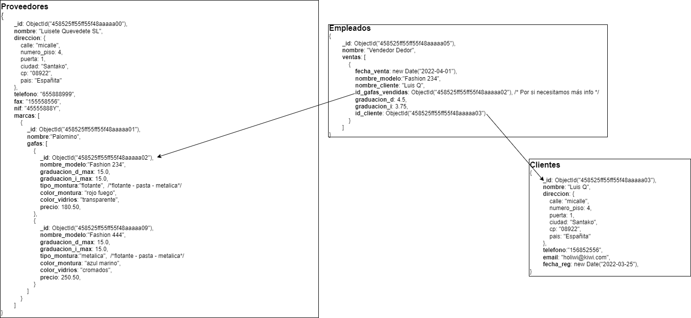
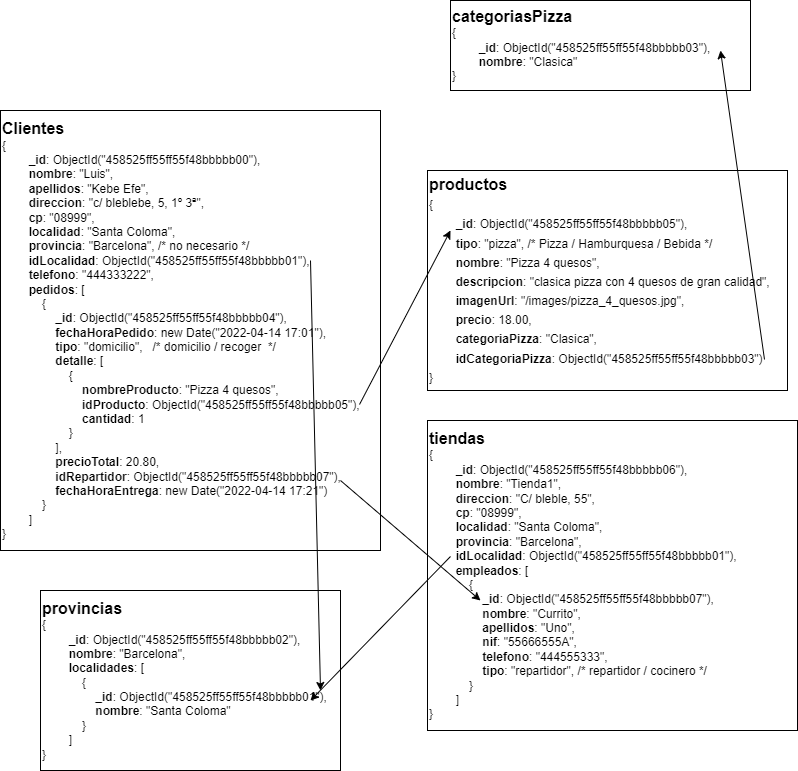
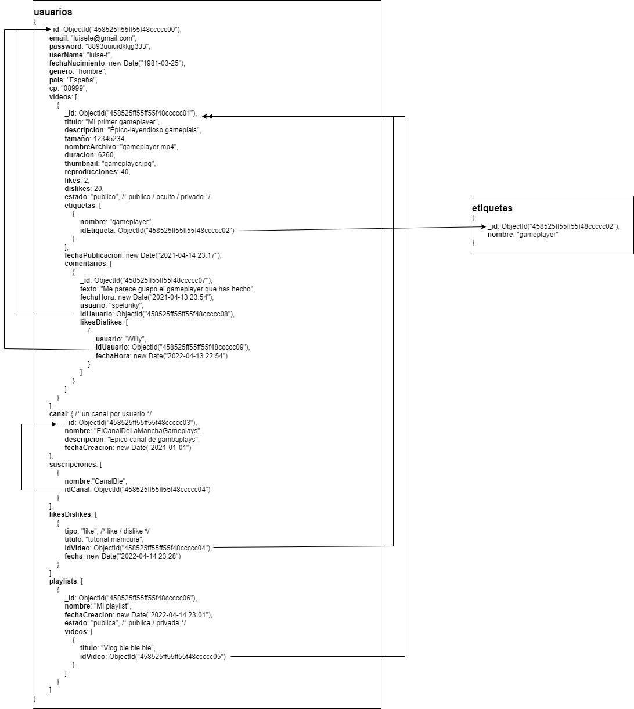
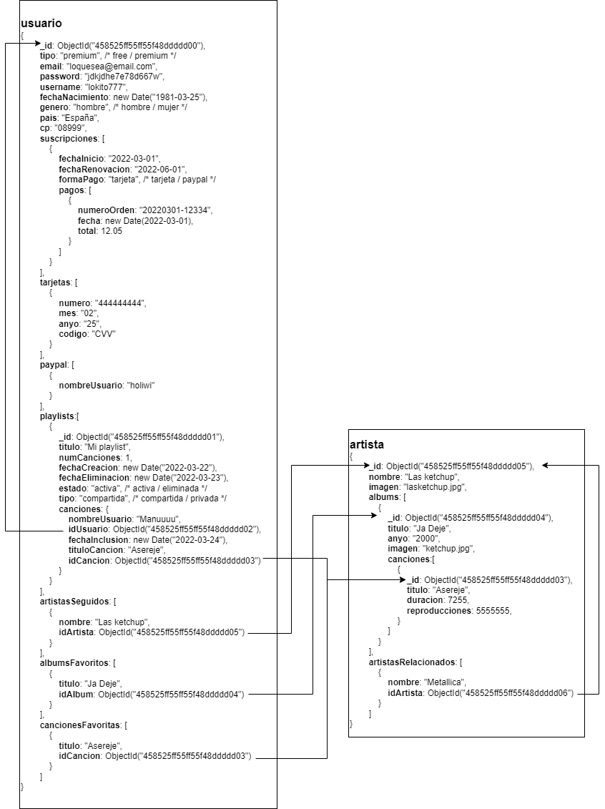

# Entrega 2.3: Estructura de dades MongoDB
Los scripts **.js** los puedes encontrar en la carpeta raiz. Los diagramas los puedes encontrar en la carpeta **diagramas**
## Nivel 1
### Ejercicio 1 - Óptica
#### Script
fichero con script de generación de BD **optica.js**
Para ejecutarlo:
```
npm run optica
```
#### Diagrama

### Ejercicio 2 - Pizzeria
#### Script
fichero con script de generación de BD **pizzeria.js**
Para ejecutarlo:
```
npm run pizzeria
```
#### Diagrama

## Nivel 2
### Ejercicio 1 - Youtube
#### Script
fichero con script de generación de BD **youtube.js**
Para ejecutarlo:
```
npm run youtube
```
#### Diagrama

## Nivel 3
### Ejercicio 1 - spotify
#### Script
fichero con script de generación de BD **spotify.js**
Para ejecutarlo:
```
npm run spotify
```
#### Diagrama



TODO:ELIMINAR
#Feedback Omar
N1-E1

- En la optica es un poco raro que relaciones clientes con sus gafas a traves del empleado, podria estar directamente el id del cliente en las gafas

- en la pizzeria eliminaria las tablas de categorias y la de provincias (no es mucha duplicidad de datos que esten directamente dentro de sus progenitores y asi se simplifica el diseño)

El resto bastante correcto, buen trabajo!